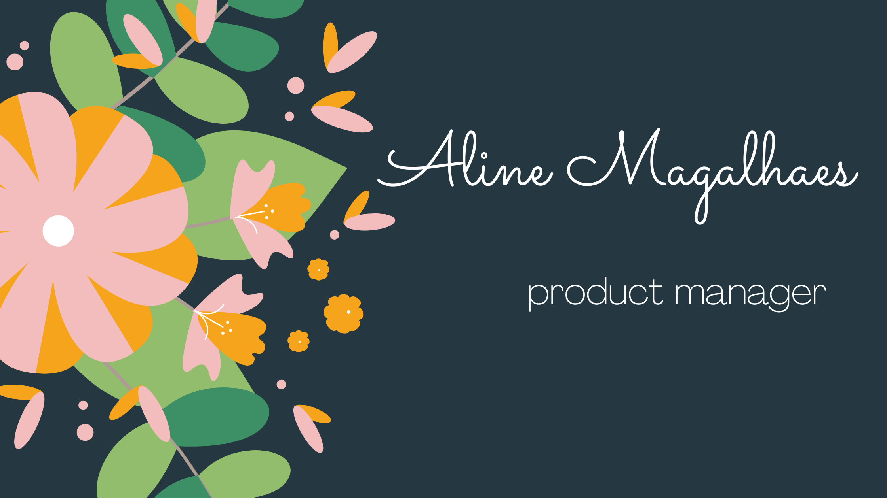

# Hi there 👋 I'm Aline

**Hard-working, Innovative, Cross-Functional** professional with extensive experience in product and project management, leading cross-functional teams to plan, build, launch and manage top-performing solutions, with Agile/Scrum experience, marketing orientation, and analytical abilities to evolve product strategy that maximizes organization growth.

🌱 Last year, I decided to make a switch to Product Management in tech. I have done a lot of courses, from coding, product, and UX. I'm focusing on Product Management, but I wanted an immersion in all tech fronts. I recently became a Certified Scrum Product Owner :trophy:

I decided to create my portfolio to practice what I learn in bootcamps and webinars, and I'm very proud of my work!

You can find more details about my experience and skills in my portfolio.

**Skills:** REACT / JS / HTML / CSS

### 📫 How to reach me: 

- :email: aoliveiramagalhaes@gmail.com
- :computer: https://www.linkedin.com/in/aline-magalhaes
- :information_source: https://aoliveiramagalhaes.github.io/portfolio

